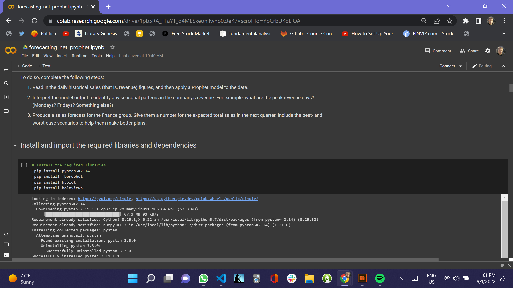

# Module_11_Challenge

# Forecasting Net Prophet

I am a growth analyst at [MercadoLibre](http://investor.mercadolibre.com/investor-relations). With over 200 million users, MercadoLibre is the most popular e-commerce site in Latin America. You've been tasked with analyzing the company's financial and user data in clever ways to make the company grow. So, I need to find out if the ability to predict search traffic can translate into the ability to successfully trade the stock.

Instructions

This section divides the instructions for this Challenge into four steps and an optional fifth step, as follows:

- Step 1: Find unusual patterns in hourly Google search traffic

- Step 2: Mine the search traffic data for seasonality

- Step 3: Relate the search traffic to stock price patterns

- Step 4: Create a time series model with Prophet

- Step 5 (optional): Forecast revenue by using time series models

## Technologies

I created it in Google Colab and also set it up to view it in Jupyter Lab. If you want to use it in Jupyter Lab then change the commented out sections in the forecasting_net_prophet file.

---

## Installation Guide

!pip install pystan~=2.14
!pip install fbprophet
!pip install hvplot
!pip install holoviews

git clone https://github.com/JeffSmith-ok/Module_11_Challenge

cd Module_11_Challenge

Load into https://colab.research.google.com/

---

## Usage

The following images present the first notebook read in Google Colab.

##  </br>

---

## Contributors

This is the Module 11 Challenge.

My contact information is:

Name: Jeffrey M. Smith </br>
Linkedin: https://www.linkedin.com/in/jeffsmith77/ </br>
Personal email: jsmith@lexsmith.finance</br>

---

## License

MIT License

Copyright (c) 2022 Jeffrey M. Smith

Permission is hereby granted, free of charge, to any person obtaining a copy of this software and associated documentation files (the "Software"), to deal in the Software without restriction, including without limitation the rights to use, copy, modify, merge, publish, distribute, sublicense, and/or sell
copies of the Software, and to permit persons to whom the Software is furnished to do so, subject to the following conditions:

The above copyright notice and this permission notice shall be included in all copies or substantial portions of the Software.

THE SOFTWARE IS PROVIDED "AS IS", WITHOUT WARRANTY OF ANY KIND, EXPRESS OR IMPLIED, INCLUDING BUT NOT LIMITED TO THE WARRANTIES OF MERCHANTABILITY, FITNESS FOR A PARTICULAR PURPOSE AND NONINFRINGEMENT. IN NO EVENT SHALL THE AUTHORS OR COPYRIGHT HOLDERS BE LIABLE FOR ANY CLAIM, DAMAGES OR OTHER LIABILITY, WHETHER IN AN ACTION OF CONTRACT, TORT OR OTHERWISE, ARISING FROM, OUT OF OR IN CONNECTION WITH THE SOFTWARE OR THE USE OR OTHER DEALINGS IN THE
SOFTWARE.

```

```
